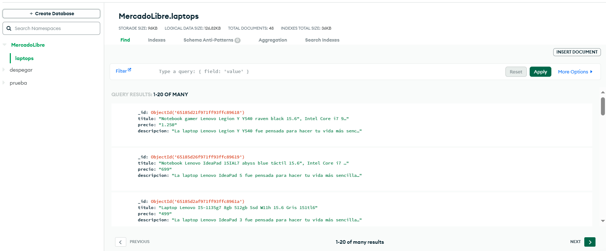

# TratamientoDatos
Extracción de datos Mercado Libre


## Inicio

Este proyecto se enfoca en el tratamiento y análisis de datos para tomar decisiones informadas, descubrir patrones y optimizar procesos. Exploraremos desde la recopilación hasta la visualización de datos. 

## Objetivo

El objetivo principal de este proyecto es desarrollar una herramienta que permita:

- Realizar búsquedas de productos en MercadoLibre.
- Extraer información detallada de los productos encontrados, como título, precio y descripción.
- Almacenar los datos en una base de datos MongoDB para su posterior análisis.
- Mostrar los resultados en una interfaz web utilizando Flask.

## Lo Realizado

Hasta el momento, hemos logrado lo siguiente:

- Configuración de un entorno virtual y la instalación de las dependencias necesarias.
- Implementación de un script de Selenium para realizar búsquedas y extraer datos de productos en MercadoLibre.
- Almacenamiento de los datos extraídos en una base de datos MongoDB.
- Configuración de una aplicación Flask para mostrar los resultados en una página web.

## Dificultades Encontradas

Durante el desarrollo de este proyecto, nos hemos enfrentado a las siguientes dificultades:

1. **Estructura de la Página:** La estructura de las páginas de MercadoLibre debido a que tienen paginación, lo que ha requerido ajustes en nuestro script para que pueda recorrer las distintas paginas y extraer la data.

2. **Diseño de la Interfaz:** La creación de una interfaz web atractiva y fácil de usar también ha sido un desafío, ya que queremos que los usuarios puedan interactuar con los datos de manera efectiva.

## Uso

### Step 1:

Create a file for environment variables: `.env`

```commandline

MONGO_USER=username # replace with yours
MONGO_PASSWORD=password # replace with yours
MONGO_HOST=cluster0.(# replace with yours).mongodb.net 
```
### Step 2:

Install libraries 

```commandline
pip install -r requirements
```

### Step 3

Run `main.py`

```commandline
python3 main.py
```

### Step 4

Check mongo results



### Step 5

Run `app.py`

```commandline
python3 app.py
```
